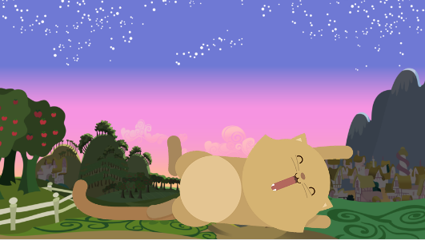

# Soft kitten 		
		

Elaborar una página responsive, de tal manera que al minimizar el área de display el fondo y la imagen de un gatito cambien. 

Debe verse de la siguiente manera: 

**A 1200px de ancho:** 

**A 900px de ancho:**

**A 600px de ancho:**

## Proceso

1. Elaboración de documento HTML. 
2. Elaboración de documento main.css (Con la versión de Desktop)
3. Elaboración de documento mobile.css (Con las verisiones de pantalla a diferente ancho.)